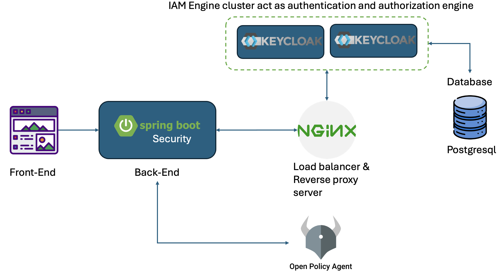

# 1. Objective

In this document, we will illustrate the application of the Identity and Access Management (IAM). Currently, this application focus only on the performance of the Identification and Authentication such as registration, login and logout of the user and Authorization based on the Role-based access control mechanism.

# 2. Technologies stacks

In order to succeed the implementation of the IAM system, I use many different technologies.

- IAM platform:
- Software development framework:
- Load balancer tool:
- Other:

# 3. System architecture

# 4. Scenarios